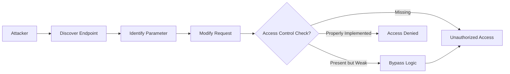

# Broken Access Control - Attack Vectors

## Table of Contents
- [Understanding Attack Vectors](#understanding-attack-vectors)
- [Common Attack Patterns](#common-attack-patterns)
- [Application Flaws That Enable Attacks](#application-flaws-that-enable-attacks)
- [Signs and Symptoms of Vulnerability](#signs-and-symptoms-of-vulnerability)
- [What Attackers Look For](#what-attackers-look-for)
- [Detection Techniques](#detection-techniques)

## Understanding Attack Vectors

> **⚠️ EDUCATIONAL PURPOSE ONLY**  
> This document describes attack concepts at a high level for educational purposes. No exploit code or weaponizable techniques are provided. Understanding these patterns helps developers build better defenses.

An **attack vector** is the method or pathway used to exploit a vulnerability. For broken access control, attackers exploit the gap between:
- What users SHOULD be able to access
- What they CAN actually access

### The Core Attack Pattern



## Common Attack Patterns

### 1. Insecure Direct Object References (IDOR)

**What it is**: Directly accessing resources by manipulating predictable identifiers without authorization checks.

**Conceptual Flow**:
```
1. User logs in and accesses their profile
   URL: /user/profile?id=12345
   
2. User observes the pattern (sequential IDs)
   
3. User modifies the ID parameter
   URL: /user/profile?id=12346
   
4. If no authorization check exists:
   → User sees another person's profile
```

**Where it appears**:
- User profiles and account data
- Order histories and invoices
- Document downloads
- API endpoints
- Database record access

**Why it works**:
- Predictable resource identifiers (sequential numbers, GUIDs)
- Missing ownership validation on the server
- Assumption that "hidden" URLs won't be discovered

### 2. Path Traversal for Access Control

**What it is**: Manipulating file paths or URLs to access unauthorized resources.

**Conceptual Flow**:
```
1. Application serves user files from:
   /files/user123/document.pdf
   
2. Attacker modifies the path:
   /files/user456/document.pdf
   OR
   /files/../admin/secret.pdf
   
3. If path validation is missing:
   → Access to unauthorized files
```

**Where it appears**:
- File download features
- Document management systems
- Profile picture/avatar systems
- Static resource serving

### 3. Privilege Escalation

**What it is**: Gaining higher-level permissions than originally granted.

**Conceptual Flow**:
```
Horizontal Escalation:
User A (customer) → Access User B's data (another customer)

Vertical Escalation:
Regular User → Access Admin functions
User → Root/System level access
```

**Where it appears**:
- Role-based features (admin panels)
- API endpoints with different permission levels
- Bulk operations (export all data)
- System configuration pages

### 4. Forced Browsing

**What it is**: Accessing pages or functions by guessing or discovering URLs not linked in the application.

**Conceptual Flow**:
```
1. Attacker explores the application structure
   
2. Discovers patterns in URLs:
   /user/dashboard
   /user/settings
   
3. Guesses admin URLs:
   /admin/dashboard (not linked but exists)
   /admin/users
   /api/admin/delete
   
4. If no role check exists:
   → Access to admin functionality
```

**Where it appears**:
- Administrative interfaces
- Debug/test pages left in production
- API endpoints not documented publicly
- Legacy or deprecated features

### 5. Parameter Tampering

**What it is**: Modifying request parameters to escalate privileges or access unauthorized data.

**Conceptual Flow**:
```
1. Legitimate request:
   POST /update-profile
   { "user_id": 12345, "role": "user" }
   
2. Attacker adds/modifies parameters:
   POST /update-profile
   { "user_id": 12345, "role": "admin", "is_admin": true }
   
3. If server doesn't validate:
   → User gains admin privileges
```

**Where it appears**:
- Form submissions
- API requests
- Cookie manipulation
- Hidden form fields

### 6. Session/Token Manipulation

**What it is**: Exploiting weak session management to access others' accounts.

**Conceptual Flow**:
```
1. Observe session token pattern:
   session_id=user_12345_2024
   
2. Predict another user's token:
   session_id=user_12346_2024
   
3. If tokens are predictable:
   → Access another user's session
```

**Where it appears**:
- Session cookies
- JWT tokens with weak secrets
- API keys
- OAuth implementations

### 7. Missing Function Level Access Control

**What it is**: Functions/endpoints accessible without proper role verification.

**Conceptual Flow**:
```
1. Application has admin functions:
   /api/users/delete
   /api/settings/modify
   
2. Frontend hides buttons from non-admins
   
3. But backend doesn't check roles
   
4. Anyone who knows the endpoint:
   → Can execute admin functions
```

**Where it appears**:
- RESTful APIs
- GraphQL queries/mutations
- Admin functions
- Bulk operations

## Application Flaws That Enable Attacks

### 1. Client-Side Only Enforcement

**The Flaw**: Relying on JavaScript, hidden buttons, or CSS to control access.

**Why it fails**:
```html
<!-- UI hides the button -->

  <style>#admin-btn { display: none; }</style>


<button id="admin-btn" onclick="deleteUser()">Delete</button>

<!-- But the function and API are still callable! -->
```

**Impact**: Attackers bypass the UI entirely using browser tools or API clients.

### 2. Inconsistent Authorization Checks

**The Flaw**: Checking permissions on some endpoints but not others.

**Why it fails**:
```python
# Protected endpoint
@app.route('/api/users')
@require_admin
def list_users():
    return jsonify(users)

# OOPS! Forgot to protect this one
@app.route('/api/users/<id>')
def get_user(id):
    return jsonify(user)  # Anyone can access!
```

**Impact**: Attackers find the unprotected endpoints through exploration.

### 3. Trusting User Input

**The Flaw**: Accepting user-supplied IDs, roles, or permissions without validation.

**Why it fails**:
```python
# VULNERABLE: Trusts user_id from request
@app.route('/profile')
def profile():
    user_id = request.args.get('user_id')  # From URL parameter
    user = get_user_by_id(user_id)
    return render_template('profile.html', user=user)

# Should verify: Does current logged-in user own this user_id?
```

**Impact**: Users can access any profile by changing the parameter.

### 4. Broken Ownership Validation

**The Flaw**: Not verifying resource ownership before granting access.

**Why it fails**:
```python
# VULNERABLE: Doesn't check if user owns the order
@app.route('/order/<order_id>')
def view_order(order_id):
    order = Order.query.get(order_id)
    return render_template('order.html', order=order)

# Should verify: current_user.id == order.user_id
```

**Impact**: Users can view/modify others' resources.

### 5. CORS Misconfiguration

**The Flaw**: Overly permissive Cross-Origin Resource Sharing settings.

**Why it fails**:
```python
# VULNERABLE: Allows all origins
@app.after_request
def add_cors_headers(response):
    response.headers['Access-Control-Allow-Origin'] = '*'
    response.headers['Access-Control-Allow-Credentials'] = 'true'
    return response
```

**Impact**: Malicious sites can make authenticated requests on behalf of users.

## Signs and Symptoms of Vulnerability

### For Security Testers

Look for these indicators:

✅ **Sequential IDs in URLs**:
```
/document?id=1234  →  Try id=1233, id=1235
/user/12345        →  Try /user/12344, /user/12346
```

✅ **Predictable Resource Paths**:
```
/files/john_doe/report.pdf  →  Try /files/jane_smith/report.pdf
```

✅ **Hidden Admin Links** (in HTML source):
```html
<!-- <a href="/admin" style="display:none">Admin</a> -->
```

✅ **API Endpoints Without Authentication Headers**:
```
Request to /api/users succeeds without Authorization header
```

✅ **Different Responses for Different Users**:
```
User A requests /profile/123  →  200 OK
User B requests /profile/123  →  Should be 403 Forbidden, but returns 200 OK
```

✅ **Error Messages Revealing Information**:
```
"User 12345 not authorized to access order 67890"
(Confirms order 67890 exists, information disclosure)
```

### For Developers (Code Smells)

⚠️ **No Authorization Checks**:
```python
@app.route('/sensitive-data')
def sensitive():
    return data  # Where's the permission check?
```

⚠️ **Authorization in Frontend Only**:
```javascript
// Client decides whether to call API
if (userRole === 'admin') {
    callAdminAPI();
}
```

⚠️ **Hard-coded Role Checks**:
```python
if user.email == 'admin@example.com':  # BAD: Hard-coded
    grant_access()
```

⚠️ **Missing Database Ownership Joins**:
```python
# Gets resource without checking ownership
resource = Resource.query.get(resource_id)
```

⚠️ **Trust of User-Supplied Roles**:
```python
role = request.form.get('role')  # User can modify this!
if role == 'admin':
    grant_admin_access()
```

## What Attackers Look For

### Reconnaissance Techniques

Attackers gather information to find access control weaknesses:

1. **URL Pattern Analysis**:
   - Study URL structures
   - Identify parameter names
   - Detect ID formats (sequential, UUID, etc.)

2. **JavaScript/Source Code Review**:
   - Inspect client-side code for API endpoints
   - Find hidden features or admin links
   - Discover business logic in frontend

3. **HTTP Traffic Analysis**:
   - Intercept requests/responses
   - Identify access control headers (or lack thereof)
   - Map API endpoints

4. **Role-Based Exploration**:
   - Create multiple accounts with different roles
   - Compare functionality and endpoints
   - Identify privilege differences

5. **Error Message Analysis**:
   - Trigger errors to reveal system information
   - Identify whether resources exist
   - Discover technology stack

### Common Discovery Methods

**Method 1: Parameter Fuzzing**
```
Test different values systematically:
/api/user?id=1
/api/user?id=2
/api/user?id=admin
/api/user?id=../admin
```

**Method 2: Role Switching**
```
1. Log in as User A, perform action
2. Log in as User B, try same action
3. Check if User B can access User A's resources
```

**Method 3: API Endpoint Discovery**
```
Search for:
- Swagger/OpenAPI documentation
- GraphQL introspection
- JavaScript bundle analysis
- robots.txt
- sitemap.xml
```

**Method 4: Automated Scanning**
```
Tools look for:
- Unprotected endpoints
- IDOR vulnerabilities
- Missing authentication
- Weak session management
```

## Detection Techniques

### Manual Testing

**Test 1: Horizontal Access**
```
1. Create Account A and Account B
2. Log in as Account A, access A's resource
3. Note the resource ID (e.g., /profile?id=123)
4. Stay logged in as Account A
5. Try to access Account B's resource (e.g., /profile?id=124)
6. Expected: 403 Forbidden
7. Vulnerable if: 200 OK (access granted)
```

**Test 2: Vertical Escalation**
```
1. Log in as regular user
2. Try accessing admin URLs:
   /admin
   /admin/users
   /api/admin/settings
3. Expected: 403 Forbidden or 404 Not Found
4. Vulnerable if: 200 OK or admin interface loads
```

**Test 3: Forced Browsing**
```
1. Map all application URLs
2. Try accessing them without authentication
3. Try accessing them with low-privilege accounts
4. Expected: Proper access control enforcement
5. Vulnerable if: Sensitive pages accessible
```

### Automated Testing

**Approach 1: Burp Suite / OWASP ZAP**
- Intercept traffic
- Test authorization on every endpoint
- Compare responses between different user roles

**Approach 2: Custom Scripts**
```python
# Conceptual test script
def test_idor(base_url, user_a_session, user_b_id):
    """Test if User A can access User B's profile"""
    response = requests.get(
        f"{base_url}/profile/{user_b_id}",
        cookies=user_a_session
    )
    assert response.status_code == 403, "IDOR vulnerability detected!"
```

**Approach 3: Authorization Testing Frameworks**
- pytest with authorization fixtures
- Selenium for UI-based testing
- Postman collections with role-based tests

## Key Takeaways for Defenders

1. 🔒 **Never trust the client** - Always validate on the server
2. 🔍 **Test with multiple user roles** - Verify isolation between users
3. 📝 **Log authorization failures** - Monitor for attack attempts
4. 🧪 **Automate authorization testing** - Make it part of CI/CD
5. 🎯 **Use centralized access control** - Don't scatter checks everywhere
6. ✅ **Deny by default** - Require explicit permission grants

## What's Next?

- **[Overview](./overview.md)**: Understand what broken access control is
- **[Prevention](./prevention.md)**: Learn how to prevent these attacks
- **[Examples](./examples.md)**: See vulnerable vs secure code
- **[Lab](./lab/broken-access-control-adminbutton/)**: Practice identifying and fixing vulnerabilities

---

*Part of the [OWASP Top 10 Educational Repository](../../README.md)*  
*Remember: This information is for defensive purposes only. Unauthorized access to computer systems is illegal.*
