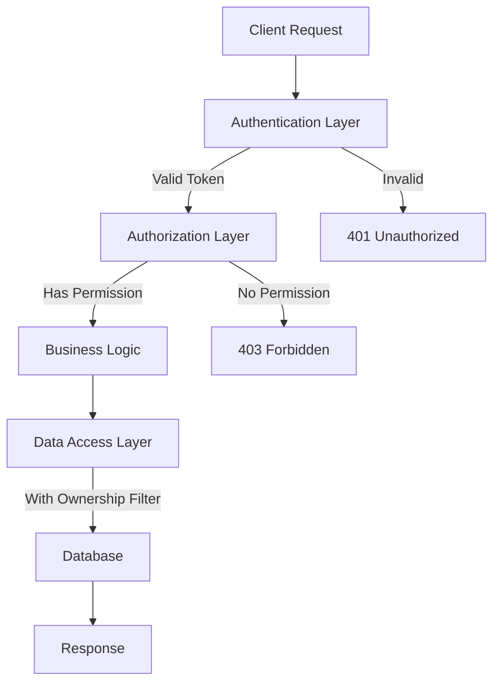
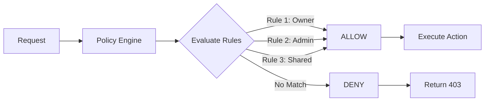

# Broken Access Control - Examples

## Table of Contents
- [Safe Pseudo-Code Examples](#safe-pseudo-code-examples)
- [Bad vs Good Code Comparisons](#bad-vs-good-code-comparisons)
- [Architecture Patterns](#architecture-patterns)
- [Configuration Examples](#configuration-examples)
- [Real-World Scenarios](#real-world-scenarios)

## Safe Pseudo-Code Examples

These examples demonstrate concepts without providing exploitable code.

### Example 1: User Profile Access

**❌ VULNERABLE: No Ownership Check**
```python
@app.route('/api/profile/<user_id>')
def get_profile(user_id):
    """Anyone can access any profile by changing the user_id"""
    user = database.get_user(user_id)
    return jsonify(user.to_dict())
```

**✅ SECURE: Verify Ownership**
```python
@app.route('/api/profile/<user_id>')
def get_profile(user_id):
    """Only the owner or admin can access this profile"""
    # Verify the user is authenticated
    if not current_user.is_authenticated:
        abort(401, "Authentication required")
    
    # Get the requested profile
    user = database.get_user(user_id)
    if not user:
        abort(404, "User not found")
    
    # Verify authorization
    if current_user.id != user_id and not current_user.is_admin:
        abort(403, "Access denied")
    
    return jsonify(user.to_dict())
```

### Example 2: Document Download

**❌ VULNERABLE: Direct File Access**
```python
@app.route('/download/<filename>')
def download_file(filename):
    """Path traversal and unauthorized access possible"""
    return send_file(f'/uploads/{filename}')
```

**✅ SECURE: Validate and Authorize**
```python
import os
from werkzeug.utils import secure_filename

@app.route('/download/<file_id>')
def download_file(file_id):
    """Validate file ownership and prevent path traversal"""
    # Get file metadata from database (not filesystem)
    file_record = File.query.get_or_404(file_id)
    
    # Verify ownership
    if file_record.owner_id != current_user.id:
        abort(403, "You don't have permission to access this file")
    
    # Secure the filename
    safe_filename = secure_filename(file_record.filename)
    file_path = os.path.join(app.config['UPLOAD_FOLDER'], safe_filename)
    
    # Verify file exists and is within upload directory
    if not os.path.abspath(file_path).startswith(app.config['UPLOAD_FOLDER']):
        abort(400, "Invalid file path")
    
    return send_file(file_path, as_attachment=True)
```

### Example 3: Admin Panel Access

**❌ VULNERABLE: Client-Side Check Only**
```javascript
// Frontend code
function loadAdminPanel() {
    if (localStorage.getItem('role') === 'admin') {
        // Anyone can modify localStorage!
        fetch('/api/admin/users')
            .then(response => response.json())
            .then(data => displayUsers(data));
    }
}
```

**✅ SECURE: Server-Side Enforcement**
```python
# Backend code
from functools import wraps

def admin_required(f):
    @wraps(f)
    def decorated_function(*args, **kwargs):
        if not current_user.is_authenticated:
            abort(401)
        if not current_user.has_role('admin'):
            abort(403, "Admin access required")
        return f(*args, **kwargs)
    return decorated_function

@app.route('/api/admin/users')
@admin_required
def get_all_users():
    """Only admins can access this endpoint"""
    users = User.query.all()
    return jsonify([user.to_dict() for user in users])
```

## Bad vs Good Code Comparisons

### Comparison 1: Order Management

**❌ BAD**
```python
@app.route('/order/<order_id>')
def view_order(order_id):
    # Problem: No authentication check
    # Problem: No ownership verification
    # Problem: Trusts user input without validation
    order = Order.query.get(order_id)
    return render_template('order.html', order=order)
```

**✅ GOOD**
```python
@app.route('/order/<int:order_id>')
@login_required
def view_order(order_id):
    # Verify ownership in the query itself
    order = Order.query.filter_by(
        id=order_id,
        user_id=current_user.id
    ).first()
    
    if not order:
        # Don't reveal if order exists for other users
        abort(404, "Order not found")
    
    return render_template('order.html', order=order)
```

### Comparison 2: API Endpoint

**❌ BAD**
```python
@app.route('/api/user/update', methods=['POST'])
def update_user():
    # Problem: Updates any user based on provided user_id
    # Problem: Trusts client to send correct user_id
    data = request.json
    user_id = data.get('user_id')
    
    user = User.query.get(user_id)
    user.email = data.get('email')
    user.role = data.get('role')  # Client can set their own role!
    db.session.commit()
    
    return {'status': 'updated'}
```

**✅ GOOD**
```python
@app.route('/api/user/update', methods=['POST'])
@login_required
def update_user():
    # Only update the current authenticated user
    user = User.query.get(current_user.id)
    data = request.json
    
    # Whitelist allowed fields
    allowed_fields = ['email', 'phone', 'address']
    
    for field in allowed_fields:
        if field in data:
            setattr(user, field, data[field])
    
    # Role changes require separate admin endpoint
    # Don't allow users to modify their own roles
    
    db.session.commit()
    return {'status': 'updated'}
```

### Comparison 3: Delete Function

**❌ BAD**
```python
@app.route('/api/comment/<comment_id>', methods=['DELETE'])
def delete_comment(comment_id):
    # Problem: Anyone can delete any comment
    comment = Comment.query.get(comment_id)
    db.session.delete(comment)
    db.session.commit()
    return {'status': 'deleted'}
```

**✅ GOOD**
```python
@app.route('/api/comment/<int:comment_id>', methods=['DELETE'])
@login_required
def delete_comment(comment_id):
    comment = Comment.query.get_or_404(comment_id)
    
    # Check if user owns the comment OR is a moderator
    if comment.user_id != current_user.id and not current_user.has_role('moderator'):
        abort(403, "You can only delete your own comments")
    
    db.session.delete(comment)
    db.session.commit()
    
    # Log the deletion for audit trail
    log_action('comment_deleted', user=current_user, comment_id=comment_id)
    
    return {'status': 'deleted'}
```

### Comparison 4: Sensitive Data Endpoint

**❌ BAD**
```python
@app.route('/api/salaries')
def get_salaries():
    # Problem: No authentication
    # Problem: Exposes all salary data to anyone
    salaries = Salary.query.all()
    return jsonify([s.to_dict() for s in salaries])
```

**✅ GOOD**
```python
@app.route('/api/salaries')
@login_required
def get_salaries():
    # Only HR and executives can view all salaries
    if current_user.has_role('hr') or current_user.has_role('executive'):
        salaries = Salary.query.all()
        return jsonify([s.to_dict() for s in salaries])
    
    # Regular employees can only see their own
    salary = Salary.query.filter_by(user_id=current_user.id).first_or_404()
    return jsonify(salary.to_dict())
```

## Architecture Patterns

### Pattern 1: Layered Security Architecture



**Implementation:**
```python
class SecurityLayer:
    """Centralized security layer"""
    
    @staticmethod
    def authenticate(request):
        """Verify user identity"""
        token = request.headers.get('Authorization')
        if not token:
            raise AuthenticationError("No token provided")
        
        user = verify_token(token)
        if not user:
            raise AuthenticationError("Invalid token")
        
        return user
    
    @staticmethod
    def authorize(user, resource, action):
        """Verify user permissions"""
        # Check role-based permissions
        if not user.can_perform(action, resource):
            raise AuthorizationError(f"Not authorized for {action}")
        
        # Check resource-specific permissions
        if hasattr(resource, 'check_access'):
            if not resource.check_access(user, action):
                raise AuthorizationError("Access denied to this resource")
        
        return True

# Use in endpoints
@app.route('/api/document/<doc_id>', methods=['PUT'])
def update_document(doc_id):
    # Authenticate
    user = SecurityLayer.authenticate(request)
    
    # Get resource
    document = Document.query.get_or_404(doc_id)
    
    # Authorize
    SecurityLayer.authorize(user, document, 'update')
    
    # Proceed with business logic
    document.update(request.json)
    return {'status': 'updated'}
```

### Pattern 2: Policy-Based Access Control



**Implementation:**
```python
class AccessPolicy:
    """Define access control policies"""
    
    @staticmethod
    def can_read_document(user, document):
        """Policy for reading documents"""
        rules = [
            document.owner_id == user.id,  # Owner
            document.is_public,  # Public document
            user.id in document.shared_with_users,  # Explicitly shared
            user.department_id == document.department_id,  # Same department
            user.has_role('admin'),  # Admin override
        ]
        return any(rules)
    
    @staticmethod
    def can_write_document(user, document):
        """Policy for writing documents"""
        rules = [
            document.owner_id == user.id,  # Owner
            user.id in document.editors,  # Explicit editor permission
            user.has_role('admin'),  # Admin override
        ]
        return any(rules)
    
    @staticmethod
    def can_delete_document(user, document):
        """Policy for deleting documents"""
        rules = [
            document.owner_id == user.id,  # Only owner
            user.has_role('admin'),  # Or admin
        ]
        return any(rules)

# Use in code
@app.route('/document/<doc_id>')
def view_document(doc_id):
    doc = Document.query.get_or_404(doc_id)
    
    if not AccessPolicy.can_read_document(current_user, doc):
        abort(403)
    
    return render_template('document.html', doc=doc)
```

### Pattern 3: Multi-Tenancy Isolation

```python
class TenantIsolation:
    """Ensure data isolation in multi-tenant applications"""
    
    @staticmethod
    def get_tenant_id():
        """Get current tenant from context"""
        return current_user.tenant_id
    
    @staticmethod
    def filter_query(query):
        """Automatically filter queries by tenant"""
        tenant_id = TenantIsolation.get_tenant_id()
        return query.filter_by(tenant_id=tenant_id)

# Apply to all queries
@app.route('/api/users')
@login_required
def get_users():
    # Automatically filtered to current tenant
    query = User.query
    query = TenantIsolation.filter_query(query)
    
    users = query.all()
    return jsonify([u.to_dict() for u in users])

# Or use SQLAlchemy events
@event.listens_for(Session, 'after_attach')
def receive_after_attach(session, instance):
    """Automatically set tenant_id on new objects"""
    if hasattr(instance, 'tenant_id') and not instance.tenant_id:
        instance.tenant_id = current_user.tenant_id
```

## Configuration Examples

### Example 1: Flask Security Configuration

```python
# config.py
class SecurityConfig:
    # Session security
    SESSION_COOKIE_SECURE = True  # HTTPS only
    SESSION_COOKIE_HTTPONLY = True  # No JavaScript access
    SESSION_COOKIE_SAMESITE = 'Lax'  # CSRF protection
    PERMANENT_SESSION_LIFETIME = timedelta(hours=2)
    
    # CSRF protection
    WTF_CSRF_ENABLED = True
    WTF_CSRF_TIME_LIMIT = None  # No time limit
    
    # Password security
    SECURITY_PASSWORD_HASH = 'bcrypt'
    SECURITY_PASSWORD_SALT = os.environ.get('SECURITY_PASSWORD_SALT')
    
    # Login attempts
    SECURITY_LOGIN_ATTEMPTS = 5
    SECURITY_LOGIN_LOCKOUT_DURATION = timedelta(minutes=30)

# app.py
from flask_security import Security, SQLAlchemyUserDatastore

user_datastore = SQLAlchemyUserDatastore(db, User, Role)
security = Security(app, user_datastore)
```

### Example 2: Role Definitions

```python
# models.py
roles_users = db.Table('roles_users',
    db.Column('user_id', db.Integer(), db.ForeignKey('user.id')),
    db.Column('role_id', db.Integer(), db.ForeignKey('role.id'))
)

class Role(db.Model):
    id = db.Column(db.Integer(), primary_key=True)
    name = db.Column(db.String(80), unique=True)
    description = db.Column(db.String(255))

class User(db.Model):
    id = db.Column(db.Integer, primary_key=True)
    email = db.Column(db.String(255), unique=True, nullable=False)
    password = db.Column(db.String(255), nullable=False)
    roles = db.relationship('Role', secondary=roles_users)
    
    def has_role(self, role_name):
        return any(role.name == role_name for role in self.roles)

# Initialize default roles
def create_default_roles():
    roles = ['admin', 'user', 'moderator', 'viewer']
    for role_name in roles:
        if not Role.query.filter_by(name=role_name).first():
            role = Role(name=role_name)
            db.session.add(role)
    db.session.commit()
```

### Example 3: API Authentication

```python
# api_auth.py
from flask_httpauth import HTTPTokenAuth

auth = HTTPTokenAuth(scheme='Bearer')

@auth.verify_token
def verify_token(token):
    """Verify JWT token"""
    try:
        data = jwt.decode(
            token,
            app.config['SECRET_KEY'],
            algorithms=['HS256']
        )
        user_id = data.get('user_id')
        user = User.query.get(user_id)
        return user
    except:
        return None

@auth.error_handler
def auth_error(status):
    return jsonify({'error': 'Unauthorized access'}), status

# Use in routes
@app.route('/api/protected')
@auth.login_required
def protected_api():
    user = auth.current_user()
    return jsonify({'message': f'Hello {user.email}'})
```

## Real-World Scenarios

### Scenario 1: E-commerce Order System

```python
class OrderAccessControl:
    """Access control for e-commerce orders"""
    
    @staticmethod
    def can_view_order(user, order):
        """Who can view an order?"""
        return any([
            order.customer_id == user.id,  # Customer who placed it
            user.has_role('support'),  # Support staff
            user.has_role('admin'),  # Administrators
        ])
    
    @staticmethod
    def can_modify_order(user, order):
        """Who can modify an order?"""
        # Only before shipment
        if order.status in ['shipped', 'delivered']:
            return False
        
        return any([
            order.customer_id == user.id,  # Customer (cancel/modify)
            user.has_role('admin'),  # Admin can always modify
        ])
    
    @staticmethod
    def can_refund_order(user, order):
        """Who can issue refunds?"""
        return any([
            user.has_role('support'),  # Support staff
            user.has_role('admin'),  # Administrators
        ])

@app.route('/api/orders/<int:order_id>')
@login_required
def get_order(order_id):
    order = Order.query.get_or_404(order_id)
    
    if not OrderAccessControl.can_view_order(current_user, order):
        abort(403, "You don't have permission to view this order")
    
    return jsonify(order.to_dict())
```

### Scenario 2: Multi-Tenant SaaS Platform

```python
class SaaSAccessControl:
    """Access control for multi-tenant SaaS"""
    
    @staticmethod
    def ensure_same_tenant(user, resource):
        """Verify user and resource belong to same tenant"""
        if user.tenant_id != resource.tenant_id:
            raise SecurityError("Cross-tenant access denied")
    
    @staticmethod
    def can_manage_users(user):
        """Who can manage users in their tenant?"""
        return user.has_role('account_admin') or user.has_role('owner')
    
    @staticmethod
    def can_access_billing(user):
        """Who can access billing information?"""
        return user.has_role('owner') or user.has_role('billing_admin')

@app.route('/api/tenant/users')
@login_required
def get_tenant_users():
    if not SaaSAccessControl.can_manage_users(current_user):
        abort(403, "Insufficient permissions")
    
    # Automatically filtered to user's tenant
    users = User.query.filter_by(
        tenant_id=current_user.tenant_id
    ).all()
    
    return jsonify([u.to_dict() for u in users])
```

### Scenario 3: Healthcare System (HIPAA Compliance)

```python
class HealthcareAccessControl:
    """HIPAA-compliant access control"""
    
    @staticmethod
    def can_view_patient_record(user, patient):
        """Strict rules for viewing patient data"""
        # Log all access attempts
        log_access_attempt(user, patient, 'view')
        
        return any([
            patient.id == user.id,  # Patient viewing own record
            patient.primary_doctor_id == user.id,  # Assigned doctor
            user.id in patient.care_team_ids,  # Care team member
            user.has_role('emergency') and user.on_duty,  # Emergency access
            user.has_role('admin') and user.has_accessed_reason,  # Admin with reason
        ])
    
    @staticmethod
    def can_modify_patient_record(user, patient):
        """Who can modify records?"""
        log_access_attempt(user, patient, 'modify')
        
        # Patients cannot modify their own records
        if patient.id == user.id:
            return False
        
        return any([
            patient.primary_doctor_id == user.id,
            user.id in patient.care_team_ids,
        ])

@app.route('/api/patient/<int:patient_id>')
@login_required
def get_patient_record(patient_id):
    patient = Patient.query.get_or_404(patient_id)
    
    if not HealthcareAccessControl.can_view_patient_record(current_user, patient):
        # Log unauthorized access attempt
        security_log.warning(
            f"Unauthorized access attempt: User {current_user.id} "
            f"tried to access Patient {patient_id}"
        )
        abort(403, "Access denied - Unauthorized access attempts are logged")
    
    # Log successful access for audit trail
    audit_log.info(f"User {current_user.id} accessed Patient {patient_id}")
    
    return jsonify(patient.to_dict())
```

## Key Takeaways

1. ✅ **Always validate on server-side** - Client checks are just UI convenience
2. ✅ **Check ownership for every resource** - Don't trust URL parameters
3. ✅ **Use centralized access control** - Consistent logic across app
4. ✅ **Log authorization failures** - Monitor for attacks
5. ✅ **Test with multiple roles** - Verify isolation between users
6. ✅ **Default to deny** - Explicitly grant access

## What's Next?

- **[Overview](./overview.md)**: Understand what broken access control is
- **[Attack Vectors](./attack-vectors.md)**: Learn how attacks happen
- **[Prevention](./prevention.md)**: Best practices for prevention
- **[Lab](./lab/broken-access-control-adminbutton/)**: Hands-on practice

---

*Part of the [OWASP Top 10 Educational Repository](../../README.md)*
