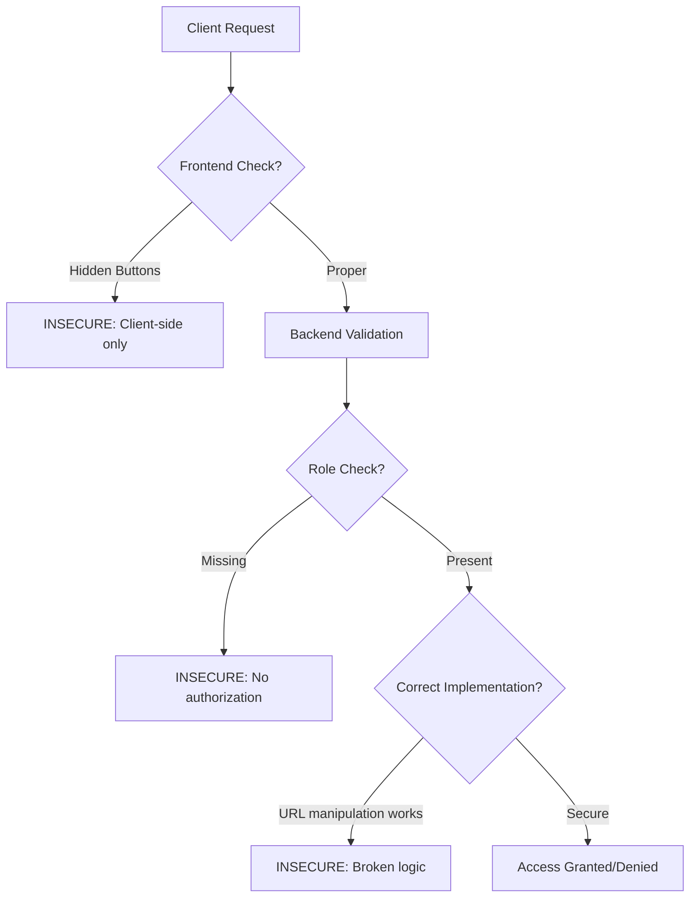

# Broken Access Control - Overview

## Table of Contents
- [What is Broken Access Control?](#what-is-broken-access-control)
- [Why Does This Matter?](#why-does-this-matter)
- [Technical Context](#technical-context)
- [Real-World Impact](#real-world-impact)
- [Prevalence and Statistics](#prevalence-and-statistics)
- [Common Misunderstandings](#common-misunderstandings)

## What is Broken Access Control?

**Broken Access Control** occurs when an application fails to properly enforce restrictions on what authenticated users are allowed to do. In simpler terms, users can access data or functionality they shouldn't have access to.

Access control enforces policy such that users cannot act outside of their intended permissions. Failures typically lead to:

- **Unauthorized information disclosure**: Viewing sensitive data
- **Modification or destruction of data**: Changing or deleting information
- **Performing unauthorized functions**: Executing business functions outside permitted scope

### Core Concept

At its heart, access control answers the question: **"Who can do what?"**

When this fundamental security mechanism breaks down, the consequences can be catastrophic:

```
User A (Regular User) → Should only access their own data
User B (Admin) → Should access all data and administrative functions

BROKEN ACCESS CONTROL = User A can access User B's functions or other users' data
```

## Why Does This Matter?

Broken Access Control moved to **#1 position** in the OWASP Top 10 2021 (from #5 in 2017), indicating it's the most common and critical vulnerability in modern web applications.

### The Business Impact

- **Data Breaches**: Exposure of customer data, intellectual property, or trade secrets
- **Regulatory Fines**: GDPR, CCPA, HIPAA violations can result in millions in fines
- **Reputation Damage**: Loss of customer trust and brand value
- **Financial Loss**: Direct theft, fraud, or business disruption
- **Legal Liability**: Lawsuits from affected customers or partners

### The Technical Impact

- **Privilege Escalation**: Regular users gain admin privileges
- **Horizontal Access**: Users access other users' data at the same privilege level
- **Vertical Access**: Users access higher privilege functionality
- **Direct Object References**: Manipulation of IDs to access unauthorized resources

## Technical Context

### Authentication vs Authorization

It's critical to understand the difference:

| Authentication | Authorization |
|----------------|---------------|
| **Who are you?** | **What can you do?** |
| Verifying identity | Verifying permissions |
| Login, passwords, 2FA | Roles, permissions, ACLs |
| Happens once per session | Checked for every action |

**Broken Access Control is an AUTHORIZATION problem**, not authentication.

Even with perfect authentication, you can have broken access control:
- ✅ User successfully logs in (authentication works)
- ❌ User accesses admin panel (authorization fails)

### Where Access Control Can Break



Access control can fail at multiple layers:

1. **Client-Side Only**: Hiding buttons/links without backend enforcement
2. **Missing Checks**: No authorization logic at all
3. **Incomplete Checks**: Only checking some endpoints
4. **Flawed Logic**: Incorrect permission evaluation
5. **Insecure Direct Object References**: Predictable resource IDs without validation

## Real-World Impact

### Case Study 1: Facebook (2018)
**Vulnerability**: Access token exposure allowed attackers to access 50 million accounts  
**Impact**: $5 billion FTC fine, massive reputation damage  
**Root Cause**: Broken access control in "View As" feature

### Case Study 2: Equifax (2017)
**Vulnerability**: Broken access control allowed unauthorized database queries  
**Impact**: 147 million records exposed, $700 million settlement  
**Root Cause**: Inadequate access controls on sensitive data

### Case Study 3: Instagram (2019)
**Vulnerability**: API allowed access to private account data  
**Impact**: Millions of accounts scraped, user privacy violated  
**Root Cause**: Missing authorization checks on API endpoints

### Common Attack Scenarios

#### Scenario 1: URL Manipulation
```
Normal user accesses:
https://example.com/account?user_id=12345

Attacker modifies URL:
https://example.com/account?user_id=12346
→ Gains access to another user's account!
```

#### Scenario 2: Function Level Access
```
Regular user discovers admin URL:
https://example.com/admin/delete_user?id=999

No role check implemented:
→ Regular user can delete other users!
```

#### Scenario 3: API Abuse
```
Mobile app uses API endpoint:
POST /api/v1/user/12345/promote

No server-side role validation:
→ User promotes themselves to admin!
```

#### Scenario 4: Hidden UI Elements
```
Admin button hidden with CSS:
<button id="admin-panel" style="display:none">

User inspects HTML and clicks:
→ Accesses admin functionality!
```

## Prevalence and Statistics

### OWASP Top 10 2021 Data

- **94%** of applications tested had some form of broken access control
- **#1** most common vulnerability category
- **318,000+** occurrences in the dataset analyzed
- Average incidence rate: **3.81%** of applications
- Maximum incidence rate: **55.97%** in some industry sectors

### Common Weakness Enumeration (CWE) Mappings

Broken Access Control maps to 34 different CWEs, including:

- **CWE-200**: Exposure of Sensitive Information
- **CWE-201**: Insertion of Sensitive Information Into Sent Data
- **CWE-352**: Cross-Site Request Forgery (CSRF)
- **CWE-359**: Exposure of Private Personal Information
- **CWE-639**: Insecure Direct Object Reference (IDOR)
- **CWE-284**: Improper Access Control
- **CWE-285**: Improper Authorization
- **CWE-732**: Incorrect Permission Assignment

### Industry Impact

Different industries face varying levels of risk:

| Industry | Risk Level | Common Targets |
|----------|------------|----------------|
| Healthcare | Critical | Patient records (HIPAA) |
| Financial | Critical | Account data, transactions |
| E-commerce | High | Customer data, orders |
| SaaS | High | Multi-tenant data |
| Government | Critical | Citizen information |
| Education | Medium | Student records (FERPA) |

## Common Misunderstandings

### Myth 1: "Authentication = Security"
**Reality**: Authentication only proves identity. Authorization determines what that identity can do.

```python
# NOT ENOUGH:
@app.route('/admin')
def admin_panel():
    if current_user.is_authenticated:  # Only checks if logged in
        return render_template('admin.html')
    
# CORRECT:
@app.route('/admin')
def admin_panel():
    if current_user.is_authenticated and current_user.is_admin:  # Checks role
        return render_template('admin.html')
    else:
        abort(403)  # Forbidden
```

### Myth 2: "Hidden = Secure"
**Reality**: Hiding UI elements or URLs does NOT prevent access. Security through obscurity is not security.

```html
<!-- INSECURE: Button is hidden but endpoint is accessible -->

  <button onclick="deleteUser()">Delete User</button>


<!-- The endpoint /api/delete-user is still accessible to anyone! -->
```

### Myth 3: "Frontend Validation is Enough"
**Reality**: All authorization must happen on the server. Clients can be manipulated.

```javascript
// INSECURE: Client-side check only
if (userRole === 'admin') {
    fetch('/api/sensitive-data');  // Anyone can call this!
}

// SECURE: Server validates every request
// Client calls API, server checks role before responding
```

### Myth 4: "We Use HTTPS, So We're Safe"
**Reality**: HTTPS encrypts data in transit but doesn't enforce access control.

```
HTTPS protects: Data from being intercepted
HTTPS does NOT protect: Unauthorized access to endpoints
```

### Myth 5: "APIs Don't Need Access Control"
**Reality**: APIs are often MORE vulnerable because they're designed for programmatic access.

Mobile apps, SPAs, and third-party integrations all use APIs that MUST have robust access control.

## Key Takeaways

1. ✅ **Access control must be enforced on the server-side** - Never trust the client
2. ✅ **Deny by default** - Start with no access, explicitly grant permissions
3. ✅ **Check authorization for EVERY request** - Not just on page load
4. ✅ **Use centralized access control mechanisms** - Don't scatter checks throughout code
5. ✅ **Log access control failures** - Monitor for attack attempts
6. ✅ **Test thoroughly** - Include authorization testing in your security testing

## What's Next?

- **[Attack Vectors](./attack-vectors.md)**: Learn how attackers exploit broken access control
- **[Prevention](./prevention.md)**: Best practices and secure coding patterns
- **[Examples](./examples.md)**: Code examples showing vulnerable vs secure implementations
- **[Lab](./lab/broken-access-control-adminbutton/)**: Hands-on practice with a safe, isolated environment

---

*Part of the [OWASP Top 10 Educational Repository](../../README.md)*
