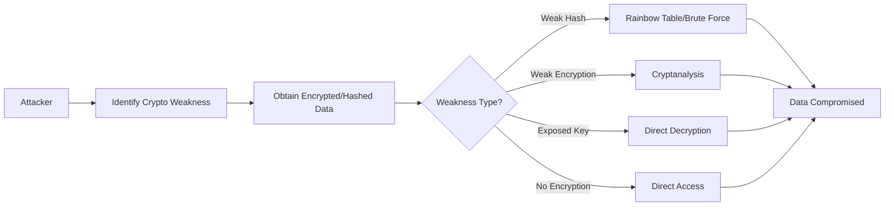

# Cryptographic Failures - Attack Vectors

## Table of Contents
- [Understanding Cryptographic Attack Vectors](#understanding-cryptographic-attack-vectors)
- [Common Attack Patterns](#common-attack-patterns)
- [Application Flaws That Enable Attacks](#application-flaws-that-enable-attacks)
- [Signs and Symptoms of Vulnerability](#signs-and-symptoms-of-vulnerability)
- [What Attackers Look For](#what-attackers-look-for)
- [Detection Techniques](#detection-techniques)

## Understanding Cryptographic Attack Vectors

> **⚠️ EDUCATIONAL PURPOSE ONLY**  
> This document describes attack concepts at a high level for educational purposes. No exploit code or weaponizable techniques are provided. Understanding these patterns helps developers build better defenses.

A cryptographic attack vector exploits weaknesses in how applications protect sensitive data through cryptography. Attackers target:
- Weak or outdated algorithms
- Implementation flaws
- Poor key management
- Missing encryption
- Predictable random values

### The Core Attack Pattern



## Common Attack Patterns

### 1. Password Hash Cracking (Rainbow Tables)

**What it is**: Using precomputed tables of hash values to reverse weak password hashes.

**Conceptual Flow**:
```
1. Attacker obtains database with password hashes
   User: alice, Hash: 5f4dcc3b5aa765d61d8327deb882cf99

2. Attacker identifies hash algorithm (MD5 in this case)
   
3. Attacker looks up hash in rainbow table
   5f4dcc3b5aa765d61d8327deb882cf99 → "password"
   
4. Attacker now has user's plaintext password
```

**Why it works**:
- Fast hashing algorithms (MD5, SHA-1) can be computed millions of times per second
- Without salt, identical passwords create identical hashes
- Rainbow tables store billions of precomputed hash values
- Unsalted hashes are vulnerable to lookup attacks

**Where it appears**:
- Legacy applications using MD5/SHA-1
- Custom authentication systems
- Database dumps from breaches
- Backup files with weak protection

### 2. Brute Force Against Weak Hashes

**What it is**: Systematically trying all possible password combinations when hashing is fast.

**Conceptual Flow**:
```
1. Obtain password hash from database
   Hash: a94a8fe5ccb19ba61c4c0873d391e987982fbbd3

2. Identify as SHA-1 (40 hex characters)

3. Attacker uses GPU to compute SHA-1 hashes
   Try "aaaa" → compute SHA-1 → compare
   Try "aaab" → compute SHA-1 → compare
   Try "aaac" → compute SHA-1 → compare
   (Billions of attempts per second with GPUs)

4. Eventually finds matching password
```

**Why it works**:
- Modern GPUs can compute billions of fast hashes per second
- Weak passwords (8 characters or less) can be cracked quickly
- No computational cost to defend against this

### 3. Man-in-the-Middle (MITM) on Unencrypted Connections

**What it is**: Intercepting data transmitted without encryption (HTTP instead of HTTPS).

**Conceptual Flow**:
```
1. User connects to application over HTTP
   http://example.com/login

2. User submits credentials
   POST /login
   username=alice&password=secret123

3. Attacker on same network intercepts traffic
   → Sees plaintext credentials
   → Can also modify requests/responses

4. Attacker uses stolen credentials
```

**Why it works**:
- HTTP transmits data in plaintext
- Anyone on the network path can read packets
- Public WiFi is particularly vulnerable
- No protection against eavesdropping

**Where it appears**:
- Sites still using HTTP
- Mixed content (HTTPS page loading HTTP resources)
- Internal applications assuming "safe" networks
- APIs without TLS

### 4. Weak TLS Configuration Exploitation

**What it is**: Exploiting outdated TLS versions or weak cipher suites.

**Conceptual Flow**:
```
1. Application supports TLS 1.0 or weak ciphers

2. Attacker performs protocol downgrade attack
   → Forces connection to use TLS 1.0
   → Or forces weak cipher suite

3. Attacker exploits known vulnerabilities
   → BEAST, CRIME, POODLE attacks
   → Decrypts intercepted traffic

4. Sensitive data exposed
```

**Why it works**:
- Older TLS versions have known vulnerabilities
- Weak cipher suites can be broken
- Backward compatibility enables downgrade attacks

### 5. Hard-Coded Key Exploitation

**What it is**: Finding encryption keys in source code or configuration files.

**Conceptual Flow**:
```
1. Attacker obtains source code or decompiles application
   
2. Searches for hard-coded keys:
   SECRET_KEY = "0123456789abcdef"
   or finds keys in config files checked into Git

3. Uses key to decrypt all data
   → Accesses encrypted database
   → Decrypts sensitive fields
   → Complete compromise

4. All "encrypted" data is now plaintext
```

**Why it works**:
- Keys in code are accessible to anyone with code access
- Version control history may contain deleted keys
- Decompilation reveals embedded keys
- Same key often used for all data

**Where it appears**:
- Mobile app code
- Public GitHub repositories
- Configuration files
- Backup files

### 6. Predictable Token Generation

**What it is**: Exploiting weak random number generation for security tokens.

**Conceptual Flow**:
```
1. Application generates session tokens:
   session_id = timestamp + user_id + random(1-100)
   
2. Attacker observes pattern:
   Session 1: 1638360000_123_42
   Session 2: 1638360001_123_89
   Session 3: 1638360002_123_17

3. Attacker predicts valid tokens:
   → Guesses timestamp (known)
   → Guesses user_id (sequential or enumerable)
   → Brute forces random part (only 100 values)

4. Hijacks other users' sessions
```

**Why it works**:
- Weak randomness creates predictable patterns
- Small keyspaces can be brute forced
- Timing information aids prediction

### 7. Insufficient Entropy in Cryptographic Operations

**What it is**: Using predictable or guessable values for cryptographic operations.

**Conceptual Flow**:
```
1. Application generates password reset tokens:
   token = md5(username + current_timestamp)

2. Attacker knows:
   → Username (public or enumerable)
   → Approximate timestamp (current time)

3. Attacker generates candidate tokens:
   → Tries all timestamps within reasonable window
   → Computes MD5 for each combination

4. Finds valid reset token, resets victim's password
```

**Why it works**:
- Predictable inputs create predictable outputs
- Limited search space makes brute force feasible
- Lack of proper random number generation

## Application Flaws That Enable Attacks

### 1. Using Fast Hashing for Passwords

**The Flaw**: Using cryptographic hash functions (MD5, SHA-256) designed for speed, not password storage.

**Why it fails**:
```python
# VULNERABLE: Too fast
import hashlib
password_hash = hashlib.sha256(password.encode()).hexdigest()

# Problem: Modern GPU can compute 100 billion SHA-256 hashes per second
# An 8-character password can be cracked in hours or days
```

**Impact**: Password databases become vulnerable to offline cracking.

### 2. No Salt in Password Hashing

**The Flaw**: Hashing passwords without unique salts per user.

**Why it fails**:
```python
# VULNERABLE: No salt
hash = hashlib.md5(password.encode()).hexdigest()

# Problem: Same password = same hash across all users
# Rainbow tables can crack all instances at once
```

**Impact**: Single rainbow table attack compromises all users with same password.

### 3. Transmitting Sensitive Data Over HTTP

**The Flaw**: Not using HTTPS for sensitive operations.

**Why it fails**:
```html
<!-- VULNERABLE: HTTP form action -->
<form action="http://example.com/login" method="POST">
  <input type="password" name="password">
</form>

<!-- Password transmitted in plaintext! -->
```

**Impact**: Credentials and sensitive data intercepted on network.

### 4. Hard-Coding Encryption Keys

**The Flaw**: Embedding cryptographic keys directly in source code.

**Why it fails**:
```python
# VULNERABLE: Hard-coded key
AES_KEY = b'sixteen byte key'

def encrypt_data(data):
    cipher = AES.new(AES_KEY, AES.MODE_EAX)
    return cipher.encrypt(data)

# Problem: Anyone with code access has the key
```

**Impact**: All encrypted data can be decrypted if code is exposed.

### 5. Using ECB Mode for Block Ciphers

**The Flaw**: Using Electronic Codebook (ECB) mode which doesn't hide patterns.

**Why it fails**:
```python
# VULNERABLE: ECB mode
cipher = AES.new(key, AES.MODE_ECB)

# Problem: Identical plaintext blocks → identical ciphertext blocks
# Patterns in data remain visible even when encrypted
```

**Impact**: Encrypted data reveals patterns and structure.

### 6. Weak Random Number Generation

**The Flaw**: Using predictable random number generators for security purposes.

**Why it fails**:
```python
# VULNERABLE: Predictable PRNG
import random
random.seed(int(time.time()))  # Predictable seed!
token = random.randint(100000, 999999)

# Problem: time() provides limited entropy
# Attacker can predict seed and replicate sequence
```

**Impact**: Security tokens become predictable and guessable.

## Signs and Symptoms of Vulnerability

### For Security Testers

Look for these indicators:

✅ **HTTP URLs for Sensitive Operations**:
```
Login page: http://example.com/login
Payment page: http://example.com/checkout
API: http://api.example.com/v1/
```

✅ **Weak Hashing Algorithms in Use**:
```
Response headers or documentation mentioning:
- MD5
- SHA-1
- Plain SHA-256 for passwords
```

✅ **Predictable Token Patterns**:
```
Session tokens:
- user_1_20231201_001
- user_1_20231201_002
- Sequential or guessable structure
```

✅ **TLS Configuration Issues**:
```bash
# Test with SSL Labs or testssl.sh
- TLS 1.0 or 1.1 enabled
- Export cipher suites allowed
- RC4 or 3DES still available
```

✅ **Exposed Cryptographic Keys**:
```
Search GitHub or source code for:
- "SECRET_KEY ="
- "API_KEY ="
- "private_key ="
```

### For Developers (Code Smells)

⚠️ **Fast Hashing for Passwords**:
```python
import hashlib
hashlib.md5(password.encode())  # RED FLAG
hashlib.sha1(password.encode())  # RED FLAG
hashlib.sha256(password.encode())  # RED FLAG (too fast)
```

⚠️ **Hard-Coded Secrets**:
```python
SECRET_KEY = "abc123"  # RED FLAG
API_KEY = "sk_live_..."  # RED FLAG
```

⚠️ **Weak Random Number Generation**:
```python
import random
random.random()  # RED FLAG for security purposes
```

⚠️ **Missing HTTPS**:
```python
# Flask without TLS enforcement
app.run(ssl_context=None)  # RED FLAG
```

⚠️ **Insecure Encryption Modes**:
```python
from Crypto.Cipher import AES
cipher = AES.new(key, AES.MODE_ECB)  # RED FLAG
```

## What Attackers Look For

### Reconnaissance Techniques

1. **Protocol Analysis**:
   - Check if site uses HTTP vs HTTPS
   - Test for TLS version downgrade
   - Identify supported cipher suites

2. **Hash Algorithm Identification**:
   - Examine hash length and format
   - Check API responses for hints
   - Review password reset tokens

3. **Source Code Review** (if available):
   - Search for hard-coded keys
   - Identify hashing algorithms
   - Find encryption implementations

4. **Database Breach Analysis**:
   - Examine leaked data structure
   - Identify hash algorithms
   - Check for salts

5. **Traffic Interception**:
   - Monitor network for HTTP traffic
   - Capture unencrypted data
   - Identify sensitive data exposure

### Common Discovery Methods

**Method 1: Hash Identification**
```bash
# Identify hash by length
32 hex chars → MD5
40 hex chars → SHA-1
64 hex chars → SHA-256
60 chars with $ → bcrypt
```

**Method 2: TLS Testing**
```bash
# Test TLS configuration
testssl.sh example.com
nmap --script ssl-enum-ciphers -p 443 example.com
```

**Method 3: Code Search**
```bash
# Search for cryptographic weaknesses
grep -r "MD5\|SHA1\|SECRET_KEY =" .
git log -p | grep -i "key\|password\|secret"
```

## Detection Techniques

### Manual Testing

**Test 1: Protocol Security**
```
1. Access application over HTTP
2. Check if HTTPS is enforced
3. Test for mixed content
4. Verify HSTS header present
```

**Test 2: Password Storage**
```
1. Create test account with known password
2. Obtain database dump (if testing allowed)
3. Examine password hash
4. Identify algorithm
5. Assess strength (bcrypt/Argon2 = good, MD5/SHA-1 = bad)
```

**Test 3: TLS Configuration**
```bash
# Use SSL Labs
https://www.ssllabs.com/ssltest/

# Or testssl.sh
testssl.sh --full example.com

Expected: TLS 1.2+, strong ciphers only
Vulnerable: TLS 1.0, weak ciphers, RC4
```

### Automated Testing

**Approach 1: Static Code Analysis**
```bash
# Scan for cryptographic issues
bandit -r . # Python
semgrep --config=p/security-audit .
```

**Approach 2: Dependency Scanning**
```bash
# Check for cryptographic library vulnerabilities
npm audit  # Node.js
safety check  # Python
```

**Approach 3: Network Scanning**
```bash
# Identify encryption issues
nmap --script ssl-* example.com
sslyze example.com
```

## Key Takeaways for Defenders

1. 🔒 **Use bcrypt or Argon2 for passwords** - Never fast hashes
2. 🔒 **Always use HTTPS** - No exceptions
3. 🔒 **Never hard-code keys** - Use environment variables or key vaults
4. 🔒 **Use cryptographically secure random** - Not random.random()
5. 🔒 **Keep crypto libraries updated** - Patch known vulnerabilities
6. 🔒 **Use established libraries** - Don't roll your own crypto

## What's Next?

- **[Overview](./overview.md)**: Understand what cryptographic failures are
- **[Prevention](./prevention.md)**: Learn how to prevent these attacks
- **[Examples](./examples.md)**: See vulnerable vs secure code
- **[Lab](./lab/weak-hashing-lab/)**: Practice identifying and fixing vulnerabilities

---

*Part of the [OWASP Top 10 Educational Repository](../../README.md)*  
*Remember: This information is for defensive purposes only. Unauthorized access to computer systems is illegal.*
