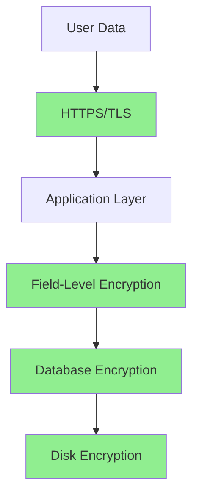

# Cryptographic Failures - Examples

## Table of Contents
- [Safe Pseudo-Code Examples](#safe-pseudo-code-examples)
- [Bad vs Good Code Comparisons](#bad-vs-good-code-comparisons)
- [Architecture Patterns](#architecture-patterns)
- [Configuration Examples](#configuration-examples)
- [Real-World Scenarios](#real-world-scenarios)

## Safe Pseudo-Code Examples

These examples demonstrate concepts without providing exploitable code.

### Example 1: Password Hashing

**❌ VULNERABLE: Using MD5**
```python
import hashlib

def store_password(username, password):
    """Weak password storage using MD5"""
    # Problem: MD5 is too fast, no salt
    password_hash = hashlib.md5(password.encode()).hexdigest()
    database.save(username, password_hash)
    # This can be cracked in seconds with modern GPUs!
```

**✅ SECURE: Using Bcrypt**
```python
import bcrypt

def store_password(username, password):
    """Secure password storage using bcrypt"""
    # Bcrypt is slow (good for passwords) and includes salt
    salt = bcrypt.gensalt(rounds=12)
    password_hash = bcrypt.hashpw(password.encode(), salt)
    database.save(username, password_hash)
    # Intentionally slow to prevent brute force attacks

def verify_password(username, password):
    """Verify password against stored hash"""
    stored_hash = database.get_password_hash(username)
    return bcrypt.checkpw(password.encode(), stored_hash)
```

### Example 2: Data Encryption

**❌ VULNERABLE: Storing Plaintext**
```python
class User:
    def __init__(self, name, ssn, credit_card):
        self.name = name
        self.ssn = ssn  # Stored as plaintext!
        self.credit_card = credit_card  # Stored as plaintext!
    
    def save(self):
        database.save({
            'name': self.name,
            'ssn': self.ssn,  # Easily accessible if database is compromised
            'credit_card': self.credit_card
        })
```

**✅ SECURE: Encrypting Sensitive Fields**
```python
from cryptography.fernet import Fernet
import os

class User:
    def __init__(self, name, ssn, credit_card):
        self.name = name
        self.cipher = Fernet(os.environ.get('ENCRYPTION_KEY').encode())
        # Encrypt sensitive data before storing
        self.ssn_encrypted = self.cipher.encrypt(ssn.encode())
        self.credit_card_encrypted = self.cipher.encrypt(credit_card.encode())
    
    def save(self):
        database.save({
            'name': self.name,  # Public data, not encrypted
            'ssn_encrypted': self.ssn_encrypted,
            'credit_card_encrypted': self.credit_card_encrypted
        })
    
    def get_ssn(self):
        """Decrypt SSN when needed"""
        return self.cipher.decrypt(self.ssn_encrypted).decode()
```

### Example 3: Session Token Generation

**❌ VULNERABLE: Predictable Tokens**
```python
import random
import time

def create_session_token(user_id):
    """Generates predictable session tokens"""
    # Problem: Using non-cryptographic random
    random.seed(int(time.time()))  # Predictable seed!
    token = f"{user_id}_{random.randint(1000, 9999)}"
    # Attacker can predict these tokens!
    return token
```

**✅ SECURE: Cryptographically Random Tokens**
```python
import secrets

def create_session_token(user_id):
    """Generates cryptographically secure session tokens"""
    # 32 bytes = 256 bits of entropy
    random_token = secrets.token_urlsafe(32)
    # Store association in database
    session_data = {
        'token': random_token,
        'user_id': user_id,
        'created_at': datetime.now()
    }
    database.save_session(session_data)
    return random_token
```

## Bad vs Good Code Comparisons

### Comparison 1: HTTPS Enforcement

**❌ BAD**
```python
from flask import Flask

app = Flask(__name__)

@app.route('/login', methods=['POST'])
def login():
    # Problem: No HTTPS enforcement
    # Credentials transmitted in plaintext if user accesses via HTTP
    username = request.form.get('username')
    password = request.form.get('password')
    # ... authentication logic
    
if __name__ == '__main__':
    app.run(host='0.0.0.0', port=80)  # HTTP only!
```

**✅ GOOD**
```python
from flask import Flask, redirect, request

app = Flask(__name__)

@app.before_request
def force_https():
    """Redirect all HTTP requests to HTTPS"""
    if not request.is_secure and not app.debug:
        url = request.url.replace('http://', 'https://', 1)
        return redirect(url, code=301)

@app.after_request
def set_security_headers(response):
    # HSTS header forces HTTPS for future requests
    response.headers['Strict-Transport-Security'] =         'max-age=31536000; includeSubDomains; preload'
    return response

if __name__ == '__main__':
    # Production should use proper TLS configuration
    import ssl
    context = ssl.SSLContext(ssl.PROTOCOL_TLS_SERVER)
    context.load_cert_chain('cert.pem', 'key.pem')
    app.run(host='0.0.0.0', port=443, ssl_context=context)
```

### Comparison 2: Encryption Mode

**❌ BAD: ECB Mode**
```python
from Crypto.Cipher import AES

def encrypt_data(data, key):
    """Insecure encryption using ECB mode"""
    cipher = AES.new(key, AES.MODE_ECB)  # INSECURE!
    # Problem: Identical plaintext blocks produce identical ciphertext
    # Patterns in data remain visible even when encrypted
    return cipher.encrypt(data)
```

**✅ GOOD: GCM Mode**
```python
from cryptography.hazmat.primitives.ciphers.aead import AESGCM
import os

def encrypt_data(data, key):
    """Secure encryption using AES-GCM"""
    aesgcm = AESGCM(key)
    nonce = os.urandom(12)  # 96-bit nonce
    # GCM provides both confidentiality and authenticity
    ciphertext = aesgcm.encrypt(nonce, data, None)
    return nonce + ciphertext  # Prepend nonce (not secret)

def decrypt_data(encrypted_data, key):
    """Decrypt data encrypted with AES-GCM"""
    aesgcm = AESGCM(key)
    nonce = encrypted_data[:12]
    ciphertext = encrypted_data[12:]
    return aesgcm.decrypt(nonce, ciphertext, None)
```

### Comparison 3: Key Management

**❌ BAD: Hard-Coded Keys**
```python
# NEVER DO THIS!
SECRET_KEY = "my-secret-key-123"
DATABASE_PASSWORD = "admin123"
API_KEY = "sk_live_1234567890abcdef"

def encrypt_user_data(data):
    cipher = Fernet(SECRET_KEY)  # Key in source code!
    return cipher.encrypt(data)
```

**✅ GOOD: Environment Variables**
```python
import os
from cryptography.fernet import Fernet

class Config:
    """Load sensitive configuration from environment"""
    
    @staticmethod
    def get_encryption_key():
        key = os.environ.get('ENCRYPTION_KEY')
        if not key:
            raise ValueError("ENCRYPTION_KEY not set in environment")
        return key.encode()
    
    @staticmethod
    def get_database_password():
        password = os.environ.get('DATABASE_PASSWORD')
        if not password:
            raise ValueError("DATABASE_PASSWORD not set in environment")
        return password

def encrypt_user_data(data):
    key = Config.get_encryption_key()
    cipher = Fernet(key)
    return cipher.encrypt(data)

# Set environment variables:
# export ENCRYPTION_KEY="your-key-here"
# export DATABASE_PASSWORD="your-db-password"
```

## Architecture Patterns

### Pattern 1: Defense in Depth



**Implementation**:
```python
class SecureUserData:
    """Multi-layer data protection"""
    
    def __init__(self):
        # Layer 1: Transport encryption (HTTPS)
        # Handled by web server
        
        # Layer 2: Application encryption
        self.field_cipher = Fernet(os.environ.get('FIELD_ENCRYPTION_KEY').encode())
        
        # Layer 3: Database encryption
        # Configured at database level
        
        # Layer 4: Disk encryption
        # Configured at OS/infrastructure level
    
    def save_user(self, user_data):
        """Save user with encrypted sensitive fields"""
        encrypted_data = {
            'username': user_data['username'],  # Public
            'email': user_data['email'],  # Public
            'ssn': self.field_cipher.encrypt(
                user_data['ssn'].encode()
            ),  # Encrypted
            'credit_card': self.field_cipher.encrypt(
                user_data['credit_card'].encode()
            )  # Encrypted
        }
        database.save(encrypted_data)
```

### Pattern 2: Separation of Duties

```python
class KeyManagement:
    """Separate key management from application logic"""
    
    @staticmethod
    def get_encryption_key(purpose: str) -> bytes:
        """Retrieve key based on purpose"""
        key_vault = KeyVault()  # External key management system
        
        key_mappings = {
            'user_pii': 'USER_PII_KEY',
            'payment': 'PAYMENT_KEY',
            'session': 'SESSION_KEY'
        }
        
        key_name = key_mappings.get(purpose)
        if not key_name:
            raise ValueError(f"Unknown key purpose: {purpose}")
        
        return key_vault.get_secret(key_name)
    
    @staticmethod
    def rotate_key(purpose: str):
        """Rotate encryption key"""
        old_key = KeyManagement.get_encryption_key(purpose)
        new_key = Fernet.generate_key()
        
        # Store new key
        key_vault = KeyVault()
        key_vault.set_secret(f"{purpose}_NEW", new_key)
        
        # Re-encrypt data with new key
        migrate_encrypted_data(old_key, new_key)
        
        # Archive old key
        key_vault.archive_secret(f"{purpose}_OLD", old_key)
```

## Configuration Examples

### Example 1: Secure Flask Configuration

```python
# config.py
import os

class ProductionConfig:
    """Production configuration with security focus"""
    
    # Session configuration
    SECRET_KEY = os.environ.get('SECRET_KEY')
    SESSION_COOKIE_SECURE = True  # HTTPS only
    SESSION_COOKIE_HTTPONLY = True  # No JavaScript access
    SESSION_COOKIE_SAMESITE = 'Lax'  # CSRF protection
    
    # Encryption keys
    ENCRYPTION_KEY = os.environ.get('ENCRYPTION_KEY')
    
    # Database with TLS
    SQLALCHEMY_DATABASE_URI = os.environ.get('DATABASE_URL').replace(
        'postgresql://',
        'postgresql+psycopg2://'
    ) + '?sslmode=require'
    
    # Password hashing
    BCRYPT_LOG_ROUNDS = 12  # Cost factor for bcrypt
    
    @staticmethod
    def init_app(app):
        # Ensure all required env vars are set
        required_vars = ['SECRET_KEY', 'ENCRYPTION_KEY', 'DATABASE_URL']
        for var in required_vars:
            if not os.environ.get(var):
                raise ValueError(f"{var} environment variable not set")
```

### Example 2: TLS Configuration

```python
# tls_config.py
import ssl

def get_secure_ssl_context():
    """Create secure SSL context for production"""
    context = ssl.SSLContext(ssl.PROTOCOL_TLS_SERVER)
    
    # Load certificate and key
    context.load_cert_chain('cert.pem', 'key.pem')
    
    # Use only strong ciphers
    context.set_ciphers('ECDHE+AESGCM:ECDHE+CHACHA20:DHE+AESGCM:DHE+CHACHA20:!aNULL:!MD5:!DSS')
    
    # Disable weak protocols
    context.minimum_version = ssl.TLSVersion.TLSv1_2
    
    # Prefer server cipher order
    context.options |= ssl.OP_CIPHER_SERVER_PREFERENCE
    
    return context

# Use in Flask
if __name__ == '__main__':
    context = get_secure_ssl_context()
    app.run(host='0.0.0.0', port=443, ssl_context=context)
```

## Real-World Scenarios

### Scenario 1: E-commerce Payment Data

```python
from cryptography.fernet import Fernet
import os

class PaymentProcessor:
    """Securely handle payment information"""
    
    def __init__(self):
        # Use dedicated key for payment data
        payment_key = os.environ.get('PAYMENT_ENCRYPTION_KEY')
        self.cipher = Fernet(payment_key.encode())
    
    def tokenize_card(self, card_number, cvv, expiry):
        """Tokenize credit card (don't store actual number)"""
        # In production, use payment gateway tokenization
        # This is simplified for demonstration
        
        # Never log or store CVV
        # Only store encrypted last 4 digits and token
        last_four = card_number[-4:]
        
        # Generate token
        import secrets
        token = f"tok_{secrets.token_urlsafe(32)}"
        
        # Store association (in production, use payment gateway)
        encrypted_card = self.cipher.encrypt(card_number.encode())
        
        database.save_payment_token({
            'token': token,
            'last_four': last_four,
            'encrypted_card': encrypted_card,  # For refunds only
            'expiry': expiry
        })
        
        return token
    
    def process_payment(self, token, amount):
        """Process payment using token"""
        # Retrieve encrypted card data
        payment_data = database.get_payment_token(token)
        card_number = self.cipher.decrypt(payment_data['encrypted_card'])
        
        # Process with payment gateway
        # ... payment processing logic
        
        # Never log full card number
        logging.info(f"Processed payment for card ending {payment_data['last_four']}")
```

### Scenario 2: Healthcare Data (HIPAA Compliance)

```python
class HealthRecordEncryption:
    """HIPAA-compliant data encryption"""
    
    def __init__(self):
        self.cipher = Fernet(os.environ.get('HIPAA_ENCRYPTION_KEY').encode())
    
    def store_patient_record(self, patient_data):
        """Encrypt and store patient health information"""
        # Encrypt all PHI (Protected Health Information)
        encrypted_record = {
            'patient_id': patient_data['id'],  # Not PHI
            'name_encrypted': self.cipher.encrypt(
                patient_data['name'].encode()
            ),
            'ssn_encrypted': self.cipher.encrypt(
                patient_data['ssn'].encode()
            ),
            'diagnosis_encrypted': self.cipher.encrypt(
                patient_data['diagnosis'].encode()
            ),
            'treatment_encrypted': self.cipher.encrypt(
                patient_data['treatment'].encode()
            )
        }
        
        # Log access (required for HIPAA compliance)
        audit_log.info(f"Patient record created: {patient_data['id']}")
        
        database.save(encrypted_record)
    
    def decrypt_for_authorized_user(self, patient_id, requesting_user):
        """Decrypt data only for authorized healthcare providers"""
        # Check authorization
        if not requesting_user.has_permission('view_patient_records'):
            audit_log.warning(
                f"Unauthorized access attempt by {requesting_user.id}"
            )
            raise PermissionError("Not authorized to view patient records")
        
        # Retrieve and decrypt
        record = database.get_patient_record(patient_id)
        
        decrypted_record = {
            'patient_id': record['patient_id'],
            'name': self.cipher.decrypt(record['name_encrypted']).decode(),
            'ssn': self.cipher.decrypt(record['ssn_encrypted']).decode(),
            'diagnosis': self.cipher.decrypt(record['diagnosis_encrypted']).decode(),
            'treatment': self.cipher.decrypt(record['treatment_encrypted']).decode()
        }
        
        # Log access (HIPAA requirement)
        audit_log.info(
            f"Patient record {patient_id} accessed by {requesting_user.id}"
        )
        
        return decrypted_record
```

## Key Takeaways

1. ✅ **Use bcrypt or Argon2 for passwords** - Never MD5/SHA-1
2. ✅ **Encrypt sensitive data with AES-GCM** - Not ECB mode
3. ✅ **Use secrets module for random values** - Not random module
4. ✅ **Always use HTTPS** - Force redirect from HTTP
5. ✅ **Never hard-code keys** - Use environment variables
6. ✅ **Keep crypto libraries updated** - Patch vulnerabilities

## What's Next?

- **[Overview](./overview.md)**: Understand what cryptographic failures are
- **[Attack Vectors](./attack-vectors.md)**: Learn how attacks happen
- **[Prevention](./prevention.md)**: Best practices for prevention
- **[Lab](./lab/weak-hashing-lab/)**: Hands-on practice

---

*Part of the [OWASP Top 10 Educational Repository](../../README.md)*
