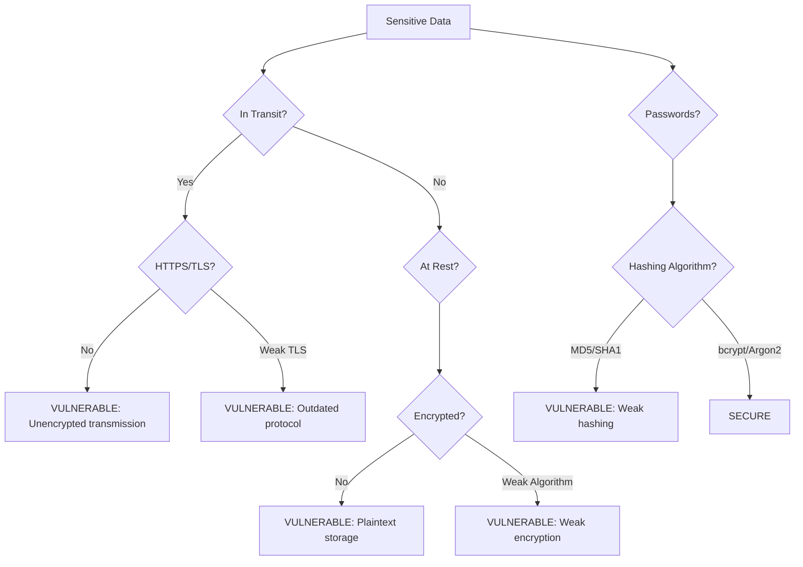

# Cryptographic Failures - Overview

## Table of Contents
- [What are Cryptographic Failures?](#what-are-cryptographic-failures)
- [Why Does This Matter?](#why-does-this-matter)
- [Technical Context](#technical-context)
- [Real-World Impact](#real-world-impact)
- [Prevalence and Statistics](#prevalence-and-statistics)
- [Common Misunderstandings](#common-misunderstandings)

## What are Cryptographic Failures?

**Cryptographic Failures** (formerly known as Sensitive Data Exposure) occur when applications fail to adequately protect sensitive data through proper encryption, hashing, or other cryptographic controls. This vulnerability class encompasses failures related to cryptography that often lead to exposure of sensitive data.

At its core, cryptographic failures happen when:

- **Weak or No Encryption**: Data transmitted or stored without adequate encryption
- **Weak Hashing Algorithms**: Using outdated algorithms like MD5 or SHA-1 for passwords
- **Improper Key Management**: Hard-coded keys, weak key generation, or exposed keys
- **Missing HTTPS/TLS**: Transmitting sensitive data over unencrypted connections
- **Inadequate Random Number Generation**: Using predictable random values for security tokens

### Core Concept

```
Sensitive Data → Should be Protected → Using Strong Cryptography

CRYPTOGRAPHIC FAILURE = Using Weak/No Cryptography → Data Exposure
```

## Why Does This Matter?

Cryptographic Failures ranked **#2** in the OWASP Top 10 2021 (up from #3 in 2017), reflecting the critical importance of protecting sensitive data in modern applications.

### The Business Impact

- **Data Breaches**: Exposure of passwords, credit cards, health records, personal data
- **Regulatory Fines**: GDPR violations up to €20M or 4% of annual revenue
- **Identity Theft**: Compromised user credentials enable account takeover
- **Financial Loss**: Direct theft of payment information
- **Reputation Damage**: Loss of customer trust and brand value
- **Legal Liability**: Class action lawsuits from affected users

### The Technical Impact

- **Password Compromise**: Weak hashing allows easy password cracking
- **Man-in-the-Middle Attacks**: Unencrypted transmission enables interception
- **Data at Rest Exposure**: Unencrypted databases vulnerable to theft
- **Session Hijacking**: Weak token generation enables prediction
- **Credential Stuffing**: Compromised passwords reused across services

## Technical Context

### Encryption vs Hashing vs Encoding

It's critical to understand these are different:

| Encryption | Hashing | Encoding |
|------------|---------|----------|
| **Reversible** | **One-way** | **Not security** |
| AES, RSA | bcrypt, Argon2 | Base64, URL encoding |
| For confidentiality | For verification | For compatibility |
| Requires key | No key needed | No key needed |
| Decrypt with key | Cannot reverse | Easily reversed |

**Common Mistake**: Using encoding (Base64) thinking it's encryption!

```python
# NOT ENCRYPTION - Anyone can decode this!
password = base64.b64encode(b"secret123")

# PROPER ENCRYPTION - Requires key to decrypt
from cryptography.fernet import Fernet
cipher = Fernet(key)
encrypted = cipher.encrypt(b"secret123")
```

### Where Cryptographic Failures Occur



Common failure points:

1. **Transmission**: No HTTPS or weak TLS configuration
2. **Storage**: Plaintext passwords or credit cards in databases
3. **Hashing**: Using MD5, SHA-1 instead of bcrypt/Argon2
4. **Keys**: Hard-coded encryption keys in source code
5. **Randomness**: Weak random number generation for tokens

## Real-World Impact

### Case Study 1: LinkedIn (2012)

**Vulnerability**: Passwords hashed with unsalted SHA-1  
**Impact**: 6.5 million password hashes leaked and quickly cracked  
**Root Cause**: Using fast hashing algorithm without salt  
**Lesson**: Always use slow, salted hashing (bcrypt, Argon2)

### Case Study 2: Adobe (2013)

**Vulnerability**: Passwords encrypted with ECB mode, weak key management  
**Impact**: 153 million user accounts compromised  
**Root Cause**: Encryption instead of hashing for passwords, weak implementation  
**Lesson**: Hash passwords, don't encrypt them; use proper encryption modes

### Case Study 3: Equifax (2017)

**Vulnerability**: Unencrypted data at rest, weak access controls  
**Impact**: 147 million records exposed including SSNs  
**Root Cause**: Multiple failures including lack of encryption  
**Lesson**: Encrypt sensitive data at rest, especially PII

### Case Study 4: British Airways (2018)

**Vulnerability**: Credit card data transmitted without proper encryption  
**Impact**: £20 million GDPR fine, 400,000 customers affected  
**Root Cause**: Insufficient encryption of payment data  
**Lesson**: Always use strong encryption for financial data

### Common Attack Scenarios

#### Scenario 1: Password Hash Cracking

```
Application uses MD5 for password hashing:
User password: "Summer2023!"
MD5 hash: "e10adc3949ba59abbe56e057f20f883e"

Attacker obtains database:
→ Runs hash through rainbow table
→ Instantly cracks password
→ Gains access to account
```

#### Scenario 2: Man-in-the-Middle

```
Application uses HTTP instead of HTTPS:
User logs in with credentials
→ Transmitted in plaintext over network
→ Attacker intercepts traffic
→ Steals username/password
```

#### Scenario 3: Exposed Encryption Keys

```
Source code contains:
SECRET_KEY = "hardcoded_key_123"

Attacker finds code on GitHub:
→ Uses key to decrypt all data
→ Accesses sensitive information
→ Complete data compromise
```

#### Scenario 4: Weak Random Tokens

```python
# Predictable session tokens
import random
session_id = random.randint(1000, 9999)  # Only 9000 possibilities!

Attacker brute forces:
→ Tries all 9000 values
→ Finds valid session
→ Hijacks user account
```

## Prevalence and Statistics

### OWASP Top 10 2021 Data

- **#2** position in OWASP Top 10
- **4.49%** average incidence rate
- **233,000+** occurrences in analyzed applications
- **46** mapped CWEs (Common Weakness Enumerations)

### Common Weakness Enumeration (CWE) Mappings

Key CWEs related to cryptographic failures:

- **CWE-259**: Use of Hard-coded Password
- **CWE-327**: Use of a Broken or Risky Cryptographic Algorithm
- **CWE-328**: Use of Weak Hash
- **CWE-329**: Generation of Predictable IV with CBC Mode
- **CWE-330**: Use of Insufficiently Random Values
- **CWE-331**: Insufficient Entropy
- **CWE-335**: Incorrect Usage of Seeds in Pseudo-Random Number Generator
- **CWE-338**: Use of Cryptographically Weak PRNG
- **CWE-759**: Use of a One-Way Hash without a Salt
- **CWE-916**: Use of Password Hash With Insufficient Computational Effort

### Industry Impact

Different data types require different protection levels:

| Data Type | Risk Level | Protection Required |
|-----------|------------|---------------------|
| Passwords | Critical | bcrypt/Argon2 hashing |
| Credit Cards | Critical | PCI-DSS encryption |
| Health Records | Critical | HIPAA encryption |
| SSN/Tax IDs | Critical | Strong encryption |
| Email Addresses | High | Encryption recommended |
| User Preferences | Low | May not need encryption |

## Common Misunderstandings

### Myth 1: "Hashing = Encryption"

**Reality**: These serve different purposes and cannot be used interchangeably.

```python
# ❌ WRONG: Trying to "decrypt" a hash
password_hash = bcrypt.hashpw(password, salt)
# Cannot get original password back from hash!

# ✅ RIGHT: Hash for verification
stored_hash = bcrypt.hashpw(password, salt)
is_valid = bcrypt.checkpw(user_input, stored_hash)  # Compare, don't decrypt
```

### Myth 2: "Base64 is Encryption"

**Reality**: Base64 is encoding, not encryption. It provides zero security.

```python
# ❌ INSECURE: Base64 encoding
import base64
"secret" = base64.b64encode(b"password")  # Trivially reversed!

# ✅ SECURE: Actual encryption
from cryptography.fernet import Fernet
cipher = Fernet(key)
encrypted = cipher.encrypt(b"password")  # Requires key to decrypt
```

### Myth 3: "MD5/SHA-1 are Fine for Passwords"

**Reality**: These fast hashes are designed for data integrity, not password storage.

```python
# ❌ VULNERABLE: Fast hash
import hashlib
hash = hashlib.md5(password.encode()).hexdigest()  # Crackable in seconds!

# ✅ SECURE: Slow, salted hash
import bcrypt
hash = bcrypt.hashpw(password.encode(), bcrypt.gensalt())  # Intentionally slow
```

### Myth 4: "HTTPS Everywhere = No Crypto Worries"

**Reality**: HTTPS protects data in transit, but not at rest or in processing.

```
HTTPS protects: Data traveling over network
HTTPS does NOT protect:
  - Data stored in database
  - Data in application memory
  - Data in log files
  - Data in backups
```

### Myth 5: "Longer Password Hash = More Secure"

**Reality**: The algorithm matters more than output length.

```python
# SHA-512 is fast (bad for passwords):
SHA-512("password") → Cracked in milliseconds

# bcrypt is slow (good for passwords):
bcrypt("password") → Takes 0.5 seconds to verify
→ Makes brute force attacks impractical
```

### Myth 6: "Rolling Your Own Crypto is OK"

**Reality**: Cryptography is extremely hard. Use established libraries.

```python
# ❌ NEVER DO THIS
def my_custom_encryption(text):
    return ''.join(chr(ord(c) + 13) for c in text)  # ROT13 is NOT encryption!

# ✅ USE ESTABLISHED LIBRARIES
from cryptography.fernet import Fernet  # Battle-tested, peer-reviewed
```

## Key Cryptographic Algorithms

### For Password Hashing (One-Way)

✅ **Recommended**:
- **Argon2** - Winner of Password Hashing Competition, best choice
- **bcrypt** - Industry standard, widely supported
- **scrypt** - Good alternative, memory-hard
- **PBKDF2** - Acceptable if others not available

❌ **Avoid**:
- MD5 - Broken, extremely fast to crack
- SHA-1 - Deprecated, vulnerable
- SHA-256/SHA-512 - Too fast for passwords
- Plain SHA-2 family without key derivation

### For Data Encryption (Reversible)

✅ **Recommended**:
- **AES-256** (GCM mode) - Industry standard symmetric encryption
- **ChaCha20-Poly1305** - Modern, fast, secure
- **RSA-2048+** - For asymmetric encryption (smaller data)

❌ **Avoid**:
- DES/3DES - Outdated, weak
- RC4 - Broken
- ECB mode - Insecure for any block cipher
- Custom encryption schemes

### For TLS/HTTPS

✅ **Recommended**:
- TLS 1.3 - Latest, most secure
- TLS 1.2 - Acceptable with strong cipher suites

❌ **Avoid**:
- SSL 2.0/3.0 - Completely broken
- TLS 1.0/1.1 - Deprecated
- Weak cipher suites (RC4, export ciphers)

## Key Takeaways

1. ✅ **Use established cryptographic libraries** - Don't roll your own
2. ✅ **Hash passwords with bcrypt or Argon2** - Never store plaintext
3. ✅ **Encrypt sensitive data at rest and in transit** - Defense in depth
4. ✅ **Use HTTPS everywhere** - Even for "non-sensitive" pages
5. ✅ **Proper key management** - Never hard-code keys
6. ✅ **Strong random number generation** - For tokens and keys
7. ✅ **Regular security updates** - Keep crypto libraries current

## What's Next?

- **[Attack Vectors](./attack-vectors.md)**: Learn how attackers exploit cryptographic weaknesses
- **[Prevention](./prevention.md)**: Best practices and secure implementation patterns
- **[Examples](./examples.md)**: Code examples showing vulnerable vs secure implementations
- **[Lab](./lab/weak-hashing-lab/)**: Hands-on practice with a safe, isolated environment

---

*Part of the [OWASP Top 10 Educational Repository](../../README.md)*
