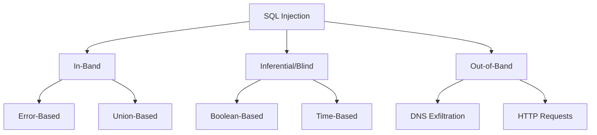

# Injection - Overview

## Table of Contents
- [What is Injection?](#what-is-injection)
- [Why Does This Matter?](#why-does-this-matter)
- [Technical Context](#technical-context)
- [Real-World Impact](#real-world-impact)
- [Prevalence and Statistics](#prevalence-and-statistics)
- [Common Misunderstandings](#common-misunderstandings)

## What is Injection?

**Injection** flaws occur when untrusted data is sent to an interpreter as part of a command or query. The attacker's hostile data can trick the interpreter into executing unintended commands or accessing data without proper authorization.

Injection vulnerabilities include:

- **SQL Injection**: Inserting malicious SQL code into queries
- **NoSQL Injection**: Manipulating NoSQL database queries
- **OS Command Injection**: Executing system commands
- **LDAP Injection**: Manipulating LDAP queries
- **XPath Injection**: Altering XPath queries
- **Expression Language (EL) Injection**: Injecting into EL expressions

### Core Concept

```
User Input → Concatenated into Command → Interpreter Executes → Unintended Behavior

INJECTION = Untrusted Data + Command/Query = Malicious Execution
```

## Why Does This Matter?

Injection ranked **#3** in the OWASP Top 10 2021, reflecting its continued prevalence and severe impact on applications worldwide.

### The Business Impact

- **Data Breaches**: Exposure of entire databases
- **Data Loss**: Deletion or modification of critical data
- **System Compromise**: Full server takeover
- **Compliance Violations**: GDPR, PCI-DSS, HIPAA breaches
- **Reputation Damage**: Loss of customer trust
- **Financial Loss**: Direct theft and recovery costs

### The Technical Impact

- **Unauthorized Data Access**: Reading sensitive database records
- **Data Manipulation**: Modifying or deleting data
- **Authentication Bypass**: Logging in without credentials
- **Privilege Escalation**: Gaining administrator access
- **Remote Code Execution**: Running arbitrary code on server

## Technical Context

### SQL Injection Types



### Where Injection Occurs

1. **Database Queries**: SQL, NoSQL
2. **OS Commands**: shell_exec, system()
3. **LDAP Queries**: User authentication
4. **XPath**: XML queries
5. **Template Engines**: Server-side template injection
6. **Object Relational Mapping**: Improper use

## Real-World Impact

### Case Study 1: Heartland Payment Systems (2008)

**Vulnerability**: SQL Injection in web application  
**Impact**: 130 million credit card numbers stolen  
**Cost**: $140 million in settlements  
**Root Cause**: Unvalidated input in SQL queries

### Case Study 2: Sony Pictures (2011)

**Vulnerability**: SQL Injection  
**Impact**: 1 million accounts compromised  
**Root Cause**: Lack of parameterized queries

### Case Study 3: TalkTalk (2015)

**Vulnerability**: SQL Injection  
**Impact**: 157,000 customer records exposed, £400,000 fine  
**Root Cause**: Legacy code with string concatenation

### Common Attack Scenarios

#### Scenario 1: Authentication Bypass

```sql
-- Vulnerable query
SELECT * FROM users WHERE username = 'admin' AND password = 'password'

-- Attack input (username field): admin' --
-- Resulting query:
SELECT * FROM users WHERE username = 'admin' --' AND password = 'password'
-- Comment removes password check!
```

#### Scenario 2: Data Extraction

```sql
-- Vulnerable query
SELECT * FROM products WHERE id = 1

-- Attack input: 1 UNION SELECT username, password FROM users --
-- Attacker retrieves user credentials
```

#### Scenario 3: Data Deletion

```sql
-- Vulnerable query
DELETE FROM logs WHERE id = 1

-- Attack input: 1; DROP TABLE users; --
-- Destroys user table!
```

## Prevalence and Statistics

### OWASP Top 10 2021 Data

- **#3** position in OWASP Top 10
- **3.37%** average incidence rate
- **274,000+** occurrences analyzed
- **33** mapped CWEs

### Common Weakness Enumeration (CWE) Mappings

- **CWE-79**: Cross-Site Scripting (XSS)
- **CWE-89**: SQL Injection
- **CWE-73**: External Control of File Name or Path
- **CWE-78**: OS Command Injection
- **CWE-94**: Code Injection
- **CWE-90**: LDAP Injection
- **CWE-91**: XML Injection

## Common Misunderstandings

### Myth 1: "Escaping Input is Enough"

**Reality**: Escaping is error-prone. Use parameterized queries instead.

```python
# ❌ WRONG: Escaping (can be bypassed)
escaped = input.replace("'", "''")
query = f"SELECT * FROM users WHERE name = '{escaped}'"

# ✅ RIGHT: Parameterized query
cursor.execute("SELECT * FROM users WHERE name = ?", (input,))
```

### Myth 2: "ORMs Prevent All Injection"

**Reality**: ORMs help but can still be vulnerable if misused.

```python
# ❌ VULNERABLE: Raw SQL in ORM
User.objects.raw(f"SELECT * FROM users WHERE name = '{user_input}'")

# ✅ SECURE: Proper ORM usage
User.objects.filter(name=user_input)
```

### Myth 3: "Only SQL is Vulnerable"

**Reality**: Many interpreters are vulnerable to injection.

- NoSQL databases (MongoDB, etc.)
- OS shells (bash, cmd)
- LDAP directories
- XPath queries
- Template engines

### Myth 4: "Input Validation Alone is Sufficient"

**Reality**: Validation helps but isn't foolproof. Use parameterized queries.

### Myth 5: "Stored Procedures are Always Safe"

**Reality**: Stored procedures can still be vulnerable if they use dynamic SQL.

```sql
-- VULNERABLE stored procedure
CREATE PROCEDURE GetUser @username VARCHAR(50)
AS
EXEC ('SELECT * FROM users WHERE username = ''' + @username + '''')
-- Still vulnerable to injection!
```

## Key Takeaways

1. ✅ **Use parameterized queries ALWAYS** - Never concatenate user input
2. ✅ **Validate and sanitize input** - Defense in depth
3. ✅ **Use ORMs properly** - Avoid raw queries
4. ✅ **Principle of least privilege** - Limit database permissions
5. ✅ **Escape output** - Context-appropriate encoding
6. ✅ **Avoid dynamic queries** - Use static SQL when possible

## What's Next?

- **[Attack Vectors](./attack-vectors.md)**: Learn how attackers exploit injection flaws
- **[Prevention](./prevention.md)**: Best practices and secure coding patterns
- **[Examples](./examples.md)**: Code examples showing vulnerable vs secure implementations
- **[Lab](./lab/unsafe-query-lab/)**: Hands-on practice with a safe, isolated environment

---

*Part of the [OWASP Top 10 Educational Repository](../../README.md)*
