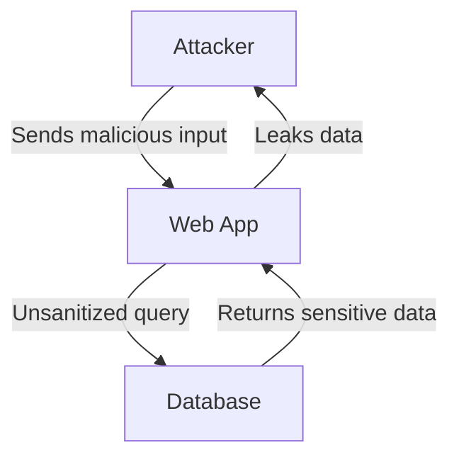

# Interactive Diagrams & Visualizations

Welcome to the OWASP Top 10 Interactive Diagrams and Visualizations! This section provides visual representations of security concepts, attack flows, architecture patterns, and risk assessments.

## 📊 Available Visualizations

### 1. Attack Flow Diagrams
Interactive diagrams showing how attacks work step-by-step:
- [Broken Access Control Attack Flow](attack-flows/broken-access-control.html)
- [SQL Injection Attack Flow](attack-flows/sql-injection.html)
- [SSRF Attack Flow](attack-flows/ssrf.html)
- [Authentication Bypass Flow](attack-flows/auth-bypass.html)
- And more...

### 2. Security Architecture Visualizations
Best practices for secure system design:
- [Secure Web Application Architecture](architecture/secure-web-app.html)
- [API Security Architecture](architecture/api-security.html)
- [Microservices Security](architecture/microservices.html)
- [Zero Trust Architecture](architecture/zero-trust.html)

### 3. Vulnerability Relationship Maps
See how vulnerabilities relate to each other:
- [OWASP Top 10 Interconnections](relationships/owasp-interconnections.html)
- [Attack Surface Map](relationships/attack-surface.html)
- [Security Control Coverage](relationships/control-coverage.html)

### 4. Risk Assessment Matrices
Evaluate and prioritize security risks:
- [Vulnerability Risk Matrix](risk-matrices/vulnerability-risk.html)
- [Threat Modeling Matrix](risk-matrices/threat-modeling.html)
- [Impact vs Likelihood](risk-matrices/impact-likelihood.html)

## 🎨 Technologies Used

All diagrams are created using:
- **Mermaid.js**: For flowcharts, sequence diagrams, and graphs
- **Interactive SVG**: For clickable, explorable diagrams
- **CSS Animations**: For dynamic, engaging visualizations
- **Responsive Design**: Works on all devices

## 🔧 Features

- ✅ **Interactive Elements**: Click and explore diagram components
- ✅ **Zoom & Pan**: Navigate complex diagrams easily
- ✅ **Color-Coded**: Risk levels and component types clearly marked
- ✅ **Exportable**: Save as PNG or SVG
- ✅ **Print-Friendly**: Optimized for printing
- ✅ **Dark Mode**: Easy on the eyes

## 📖 How to Use

1. **Click on any diagram** to open it in full screen
2. **Hover over elements** to see detailed information
3. **Click nodes** in interactive diagrams to expand details
4. **Use zoom controls** for complex diagrams
5. **Export** diagrams for presentations or documentation

## 🎯 Use Cases

### For Developers
- Understand attack vectors visually
- See secure architecture patterns
- Identify security gaps in your design
- Learn defense-in-depth strategies

### For Security Teams
- Explain vulnerabilities to stakeholders
- Create threat models
- Assess and prioritize risks
- Document security architectures

### For Educators
- Visual aids for teaching
- Interactive learning materials
- Assessment tools
- Documentation for students

### For Executives
- Quick risk assessment overview
- Business impact visualization
- Security posture at a glance
- ROI of security investments

## 📚 Diagram Types

### Flowcharts
Show step-by-step processes:
- Attack execution flows
- Secure development workflows
- Incident response procedures
- Authentication flows

### Sequence Diagrams
Illustrate interactions over time:
- Client-server communications
- Authentication sequences
- Attack scenarios
- Security protocol exchanges

### Class/Component Diagrams
Display system structure:
- Application architecture
- Security controls placement
- Component relationships
- Trust boundaries

### Network Diagrams
Show network topology:
- DMZ configurations
- Firewall placements
- Network segmentation
- Security zones

### Mind Maps
Visualize concept relationships:
- Vulnerability categories
- Attack techniques
- Defense strategies
- Learning paths

## 🎨 Color Coding

We use consistent color coding across all diagrams:

- 🔴 **Red**: Critical risks, vulnerabilities, attacks
- 🟠 **Orange**: High risk, warnings
- 🟡 **Yellow**: Medium risk, caution
- 🟢 **Green**: Secure, validated, safe
- 🔵 **Blue**: Information, neutral components
- ⚪ **Gray**: Infrastructure, background

## 🔄 Interactive Features

### Click Actions
- **Nodes**: Expand for more details
- **Edges**: Show connection information
- **Icons**: Open related documentation
- **Labels**: Display tooltips

### Keyboard Shortcuts
- `+` / `-`: Zoom in/out
- `Arrow keys`: Pan diagram
- `F`: Fit to screen
- `E`: Export diagram
- `P`: Print view

## 💾 Export Options

All diagrams can be exported as:
- **PNG**: For presentations and documents
- **SVG**: For editing and scaling
- **PDF**: For printing and sharing
- **Mermaid Code**: For editing source

## 📱 Mobile Support

All diagrams are optimized for mobile:
- Touch gestures for zoom/pan
- Simplified views for small screens
- Responsive layouts
- Offline support

## 🔗 Integration

Embed diagrams in your own documentation:

```html
<iframe src="diagrams/attack-flows/sql-injection.html" 
        width="100%" height="600px">
</iframe>
```

Or link directly:
```markdown
See [SQL Injection Attack Flow](./diagrams/attack-flows/sql-injection.html)
```

## 🤝 Contributing

Want to add or improve diagrams?
- Submit diagram ideas via Issues
- Contribute Mermaid code via Pull Requests
- Suggest improvements to existing diagrams
- Share your custom visualizations

See [CONTRIBUTING.md](../CONTRIBUTING.md) for guidelines.

## 📚 Related Resources

- [Cheat Sheets](../cheat-sheets/) - Quick reference cards
- [CTF Hub](../ctf-hub/) - Interactive challenges
- [Quiz Platform](../quiz-platform/) - Knowledge assessment
- [Compliance Mappings](../compliance-mappings/) - Standards mapping

## 🔧 Technical Details

### Mermaid.js Syntax
All diagrams use Mermaid.js markdown-like syntax:



### Customization
Modify diagrams by editing the Mermaid code in each HTML file.

### Performance
- Diagrams load progressively
- SVG-based for crisp rendering
- Lazy loading for performance
- Cached for speed

---

**Start exploring: [View All Diagrams](index.html)** 🚀
